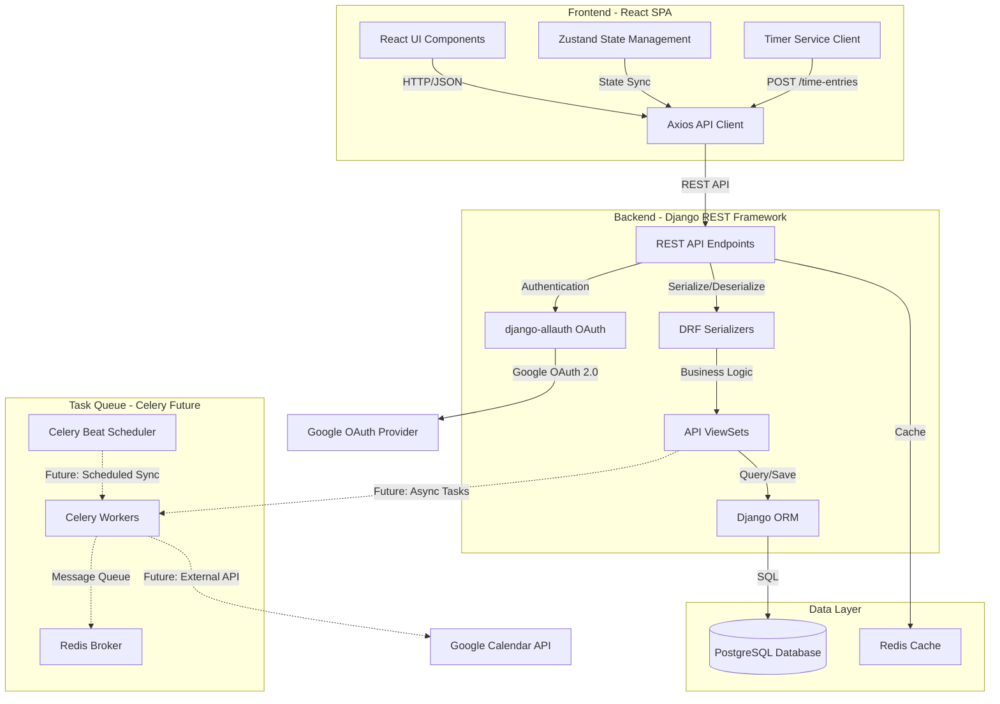
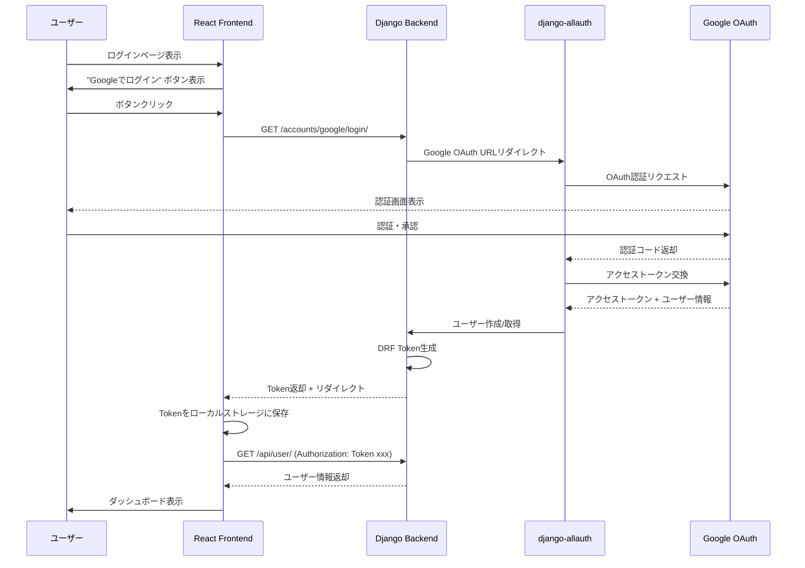
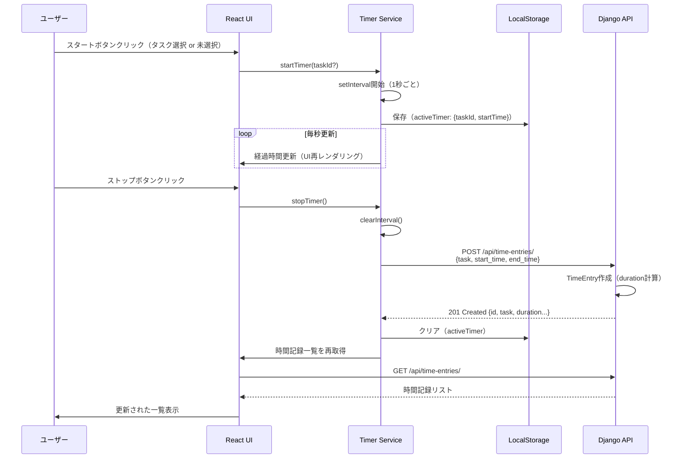
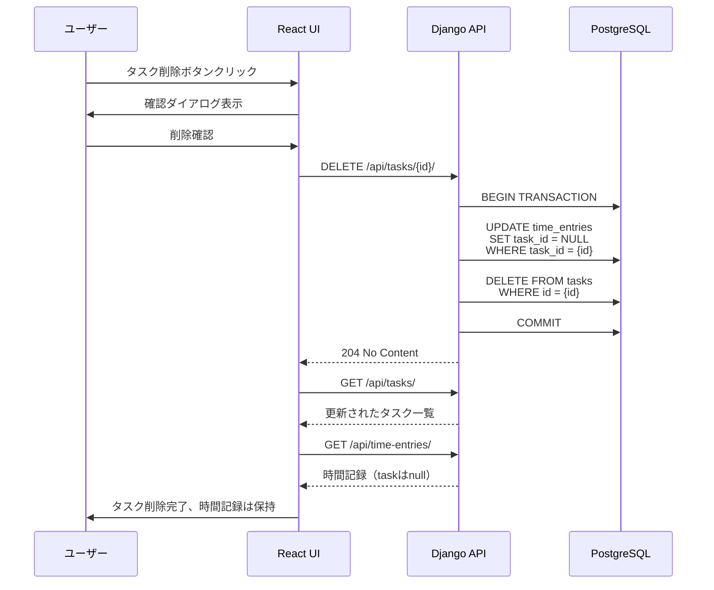
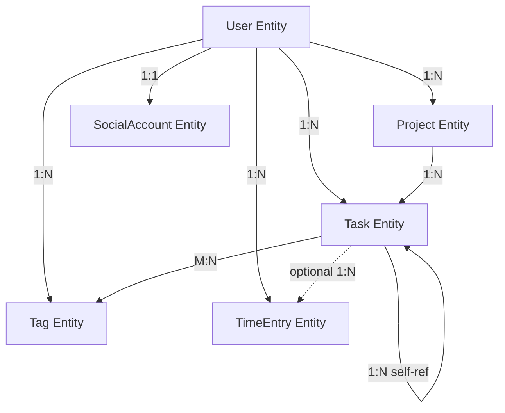
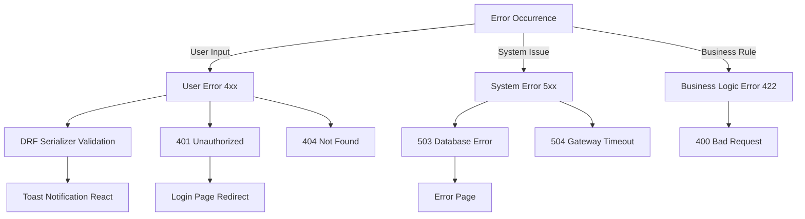

# Technical Design

## Overview

タスクタイムトラッキングWebアプリは、ユーザーがタスクに費やした時間をリアルタイムで記録・追跡し、作業時間の可視化と生産性分析を実現するWebアプリケーションです。Django REST FrameworkバックエンドとReactフロントエンドの分離構成により、スケーラブルで保守性の高いアーキテクチャを実現します。django-allauthによるGoogle OAuth認証で、複数デバイス間でのシームレスなデータアクセスを提供します。

**Purpose**: ユーザーに対して、タスクごとの時間記録とレポート機能を提供し、作業時間の可視化と生産性の向上を実現します。将来的にはCeleryによる外部サービス連携（Google Calendar同期など）を実装可能な拡張性を持ちます。

**Users**: 個人ユーザー、フリーランサー、リモートワーカーがタスク管理とタイムトラッキングのワークフローで利用します。

### Goals

- リアルタイムタイマーによる正確な時間記録の実現
- Googleアカウントによるシームレスな認証とマルチデバイス対応
- タスク未指定での時間記録に対応した柔軟な記録方式
- 日次・週次・月次レポートによる作業時間の可視化
- Django ORMによる堅牢なデータ管理とマイグレーション
- Celeryによる将来の外部サービス連携基盤の構築

### Non-Goals

- チーム管理機能（プロジェクト共有、権限管理）- Phase 1では対象外
- タスクの優先度管理やガントチャート
- 請求書生成や会計システムとの統合
- モバイルネイティブアプリケーション（PWAのみ）
- Google Calendar連携（Phase 2で実装予定）

## Architecture

### High-Level Architecture



### Technology Stack and Design Decisions

#### Backend

**選定技術**: Django 5.x + Django REST Framework 3.x + PostgreSQL
- **Django 5.x**: 成熟したWebフレームワーク、強力なORM、マイグレーション、管理画面
- **Django REST Framework (DRF)**: RESTful API構築、シリアライゼーション、認証、パーミッション
- **PostgreSQL**: リレーショナルDB、ACID特性、JSON型サポート、豊富な集計関数

**代替案との比較**:
- FastAPI: 非同期処理とパフォーマンスは優れるが、ORM・管理画面がない、学習コストとエコシステムの成熟度でDjangoを選択
- Firebase: フロントエンド開発の学習目的には適さない、SQLによる複雑なクエリが困難
- Node.js (Express + Prisma): TypeScriptエコシステムは魅力的だが、Django ORMとallauthの学習を優先

**選定理由**: Django ORMによるモデル駆動開発、マイグレーションの自動生成、管理画面での迅速なデータ確認が学習に最適。django-allauthによるOAuth実装が簡単で、将来のCelery統合も標準的なパターンが確立されている。

#### Authentication

**選定技術**: django-allauth + dj-rest-auth
- **django-allauth**: Google OAuthプロバイダー統合、ユーザー管理、複数プロバイダー対応
- **dj-rest-auth**: django-allauthのREST API化、トークン認証、JWT対応

**代替案との比較**:
- Django標準認証 + social-auth-app-django: allauthよりセットアップが複雑、管理画面統合が弱い
- Auth0 / Firebase Auth: 外部サービス依存、学習の観点から自前実装を優先
- Simple JWT単体: OAuth実装を自前で書く必要があり、学習コスト高

**選定理由**: django-allauthはGoogle OAuth連携が数行で実装可能、管理画面からSocialAppを設定、ユーザーモデルと統合済み。dj-rest-authによりAPIエンドポイントが自動生成され、フロントエンドとの連携が容易。

**Trade-offs**: JWTではなくDRFのTokenAuthenticationを使用（シンプルだが、有効期限なし）。将来的にJWT移行を検討。

#### Database

**選定技術**: PostgreSQL 16
- **理由**: Django公式推奨、JSONB型でセミ構造化データ対応、ウィンドウ関数・CTEによる複雑な集計クエリ

**代替案との比較**:
- SQLite: 開発環境では使用可能だが、本番環境で同時書き込みに弱い
- MySQL: PostgreSQLと比較してJSON型サポートが弱い、ウィンドウ関数の実装が後発
- MongoDB: リレーショナルデータに不適、Django ORMとの統合が弱い

**選定理由**: 時間記録の集計クエリ（日次・週次・月次レポート）でウィンドウ関数が有効。Django ORMとの相性が最良。

#### Frontend

**選定技術**: React 18 + TypeScript + Vite
- **React 18**: 関数コンポーネント、Hooks、Concurrent Features
- **TypeScript**: 型安全性、IDE補完、APIレスポンス型定義
- **Vite**: 高速開発サーバー、HMR、最適化されたビルド

**代替案との比較**:
- Next.js: SSRが不要なSPAのため、Viteの軽量性を優先
- Django Templates: RESTful API分離構成の学習のため、フロントエンドを分離

**選定理由**: DjangoバックエンドとReactフロントエンドの分離により、フロントエンド・バックエンド両方の技術を学習可能。TypeScriptによるAPI型定義でフロントエンド・バックエンド間の型安全性を確保。

#### State Management

**選定技術**: Zustand
- **理由**: シンプルなAPI、Redux比でボイラープレートが少ない、バンドルサイズ小（約3KB）

**適用範囲**: グローバル状態（認証状態、タスク一覧、時間記録、アクティブタイマー）

#### UI Components & Styling

**選定技術**: Tailwind CSS + Radix UI
- **Tailwind CSS**: ユーティリティファーストのスタイリング
- **Radix UI**: アクセシブルなヘッドレスコンポーネント

#### Task Queue (Future)

**選定技術**: Celery + Redis
- **Celery**: Djangoとの統合が標準的、非同期タスク実行、定期実行（Beat）
- **Redis**: メッセージブローカー、結果バックエンド、キャッシュ

**将来のユースケース**:
- Google Calendar同期（Celery Beatで定期実行）
- メール通知の非同期送信
- 大量デ���タのエクスポート処理

**代替案との比較**:
- Django Q: 軽量だが、エコシステムとドキュメントがCeleryに劣る
- RQ (Redis Queue): シンプルだが、定期実行機能が弱い
- Google Cloud Tasks: クラウドベンダーロックイン

**Trade-offs**: Celeryのセットアップは複雑だが、将来の拡張性を優先。Phase 1では実装せず、インフラのみ準備。

#### Key Design Decisions

##### Decision 1: Django ORMによるリレーショナルデータモデル

**Decision**: PostgreSQLをメインデータベースとし、Django ORMで正規化されたリレーショナルモデルを採用

**Context**: 要件8（ユーザー認証）によりユーザーごとのデータ分離が必須。要件5（レポート生成）で複雑な集計クエリが必要。

**Alternatives**:
1. **Firestore（NoSQL）**: リアルタイム同期は優れるが、複雑な集計クエリが困難、ORMの学習ができない
2. **MongoDB**: ドキュメント指向だが、トランザクションサポートが弱い、Django統合が不完全
3. **SQLite**: 開発には適しているが、本番環境での同時書き込みに問題

**Selected Approach**:
```python
# models.py
class Task(models.Model):
    user = models.ForeignKey(User, on_delete=models.CASCADE, related_name='tasks')
    name = models.CharField(max_length=100)
    estimate_minutes = models.PositiveIntegerField(null=True, blank=True)  # 見積もり作業時間(分)
    duration_seconds = models.IntegerField(default=0, editable=False)  # 実際の累計作業時間(秒)
    created_at = models.DateTimeField(auto_now_add=True)
    updated_at = models.DateTimeField(auto_now=True)

class TimeEntry(models.Model):
    user = models.ForeignKey(User, on_delete=models.CASCADE, related_name='time_entries')
    task = models.ForeignKey(Task, on_delete=models.SET_NULL, null=True, blank=True, related_name='time_entries')
    start_time = models.DateTimeField()
    end_time = models.DateTimeField()
    duration_seconds = models.IntegerField()
    created_at = models.DateTimeField(auto_now_add=True)
```

**Rationale**:
- `ForeignKey` による参照整合性の保証（タスク削除時に `SET_NULL` で時間記録を保持）
- Django ORMの `select_related`, `prefetch_related` でN+1問題を回避
- PostgreSQLのインデックスによる高速クエリ（`user_id`, `start_time`）
- マイグレーションによるスキーマ変更の追跡

**Trade-offs**: NoSQLと比較してスキーマ変更にマイグレーションが必要だが、型安全性と集計クエリの強力さを優先。

##### Decision 2: DRF ViewSetとTokenAuthenticationによるRESTful API

**Decision**: Django REST Frameworkの `ModelViewSet` でCRUD APIを自動生成、認証には `TokenAuthentication` を使用

**Context**: フロントエンドとバックエンドを完全分離し、RESTful APIで通信。Google OAuth後にトークンを発行。

**Alternatives**:
1. **GraphQL (Graphene-Django)**: 柔軟なクエリだが、学習コストが高い、キャッシュが複雑
2. **Django Templates (従来型)**: フロントエンド・バックエンド分離の学習ができない
3. **JWT認証**: より高度だが、トークンリフレッシュロジックが複雑

**Selected Approach**:
```python
# views.py
class TaskViewSet(viewsets.ModelViewSet):
    serializer_class = TaskSerializer
    permission_classes = [IsAuthenticated]

    def get_queryset(self):
        return Task.objects.filter(user=self.request.user)

    def perform_create(self, serializer):
        serializer.save(user=self.request.user)

# settings.py
REST_FRAMEWORK = {
    'DEFAULT_AUTHENTICATION_CLASSES': [
        'rest_framework.authentication.TokenAuthentication',
    ],
    'DEFAULT_PERMISSION_CLASSES': [
        'rest_framework.permissions.IsAuthenticated',
    ],
    'DEFAULT_PAGINATION_CLASS': 'rest_framework.pagination.PageNumberPagination',
    'PAGE_SIZE': 100,
}
```

**Rationale**:
- `ModelViewSet` により CRUD エンドポイントが自動生成（`list`, `create`, `retrieve`, `update`, `destroy`）
- `get_queryset` でユーザー単位のデータフィルタリングを強制
- `TokenAuthentication` はシンプルで、django-allauth + dj-rest-authと統合済み
- DRFの `IsAuthenticated` パーミッションで全エンドポイントを保護

**Trade-offs**: JWTと比較してトークンに有効期限がないため、セキュリティリスクがあるが、学習の初期段階ではシンプルさを優先。将来的にSimpleJWTへの移行を検討。

##### Decision 3: クライアント側タイマー管理 + バックエンドへのPOST

**Decision**: タイマーはReact側で `setInterval` 管理、停止時に `POST /api/time-entries/` でバックエンドに保存

**Context**: Requirement 2（リアルタイム経過時間表示）とRequirement 2.7（自動停止）を満たす必要。

**Alternatives**:
1. **WebSocketでサーバー側タイマー管理**: 複雑性が増し、Django Channelsの学習が必要
2. **ポーリング（定期的なGET）**: 不要なネットワークトラフィック、サーバー負荷
3. **バックエンドでタイマー状態管理**: ステートレスなREST APIの原則に反する

**Selected Approach**:
```typescript
// Frontend Timer Service
class TimerService {
  private intervalId: number | null = null;

  startTimer(taskId?: string) {
    const startTime = Date.now();
    this.intervalId = setInterval(() => {
      const elapsed = Date.now() - startTime;
      // UI更新
    }, 1000);

    // LocalStorageに保存
    localStorage.setItem('activeTimer', JSON.stringify({ taskId, startTime }));
  }

  async stopTimer() {
    const timer = JSON.parse(localStorage.getItem('activeTimer')!);
    clearInterval(this.intervalId!);

    // バックエンドに保存
    await axios.post('/api/time-entries/', {
      task: timer.taskId,
      start_time: new Date(timer.startTime).toISOString(),
      end_time: new Date().toISOString(),
    });

    localStorage.removeItem('activeTimer');
  }
}
```

**Rationale**:
- サーバーへの書き込みを最小化（開始と停止の2回のみ）
- `localStorage` によるページリロード時のタイマー復元
- バックエンドはステートレスで、時間記録の保存のみ担当

**Trade-offs**: マルチデバイス間でのリアルタイムタイマー同期は不可能だが、停止後のデータは即座に全デバイスで同期される。WebSocketは複雑性が高いため、Phase 1では採用しない。

## System Flows

### 認証フロー（django-allauth Google OAuth）



### タイマー操作フロー



### タスク削除と時間記録の参照更新



## Requirements Traceability

| Requirement | Requirement Summary | Components | Endpoints | Database Models |
|-------------|---------------------|------------|-----------|-----------------|
| 1.1-1.5 | タスク管理（CRUD） | TaskViewSet, TaskSerializer | GET/POST/PUT/DELETE /api/tasks/ | Task, Project |
| 2.1-2.8 | 時間記録（タイマー/手動） | TimeEntryViewSet, Timer Service (React) | POST /api/time-entries/ | TimeEntry |
| 3.1-3.4 | 時間記録の編集・削除 | TimeEntryViewSet | PUT/DELETE /api/time-entries/{id}/ | TimeEntry |
| 4.1-4.4 | 時間記録一覧とフィルター | TimeEntryViewSet, DRF FilterBackend | GET /api/time-entries/?date=...&task=...&tags=... | TimeEntry |
| 5.1-5.5 | 時間統計とレポート | ReportView (APIView), Aggregation | GET /api/reports/daily/, /weekly/, /monthly/ | TimeEntry (集計) |
| 6.1-6.4 | ユーザーインターフェース | React Components, Radix UI | - | - |
| 7.1-7.3 | データ永続化 | Django ORM, PostgreSQL | すべてのPOST/PUT | すべてのモデル |
| 8.1-8.7 | ユーザー認証 | django-allauth, dj-rest-auth | /accounts/google/login/, /api/auth/user/ | User, SocialAccount |
| 9.1-9.7 | タスク階層構造 | TaskViewSet, Task.get_depth(), Task.clean() | GET/POST /api/tasks/?parent={id} | Task (self FK) |
| 10.1-10.8 | プロジェクト管理 | ProjectViewSet, ProjectSerializer | GET/POST/PUT/DELETE /api/projects/, GET /api/reports/by-project/ | Project |
| 11.1-11.8 | タグ管理 | TagViewSet, TagSerializer, Task.tags (M2M) | GET/POST/PUT/DELETE /api/tags/, GET /api/tasks/?tags={ids} | Tag, Task-Tag (M2M) |

## Components and Interfaces

### Backend - Django REST Framework

#### TaskViewSet

**Responsibility & Boundaries**
- **Primary Responsibility**: タスクのCRUD操作、ユーザー単位のフィルタリング
- **Domain Boundary**: タスク管理APIエンドポイント
- **Data Ownership**: ユーザーのタスクデータ
- **Transaction Boundary**: 単一タスクの作成・更新・削除

**Dependencies**
- **Inbound**: React Frontend (Axios)
- **Outbound**: Task Model, TaskSerializer
- **External**: Django ORM

**API Contract**

| Method | Endpoint | Request | Response | Errors |
|--------|----------|---------|----------|--------|
| GET | /api/tasks/ | - | `[{id, name, created_at, updated_at}]` | 401 Unauthorized |
| POST | /api/tasks/ | `{name: string}` | `{id, name, created_at, updated_at}` | 400 Bad Request, 401 |
| GET | /api/tasks/{id}/ | - | `{id, name, created_at, updated_at}` | 404 Not Found, 401 |
| PUT | /api/tasks/{id}/ | `{name: string}` | `{id, name, created_at, updated_at}` | 400, 404, 401 |
| DELETE | /api/tasks/{id}/ | - | 204 No Content | 404, 401 |

**Serializer Definition**

```python
class TaskSerializer(serializers.ModelSerializer):
    class Meta:
        model = Task
        fields = ['id', 'name', 'created_at', 'updated_at']
        read_only_fields = ['id', 'created_at', 'updated_at']

    def validate_name(self, value):
        if len(value) < 1 or len(value) > 100:
            raise serializers.ValidationError("タスク名は1文字以上100文字以下で入力してください")
        return value
```

**Preconditions**:
- すべてのメソッド: ユーザーが認証済み（`Authorization: Token xxx`）
- POST/PUT: `name` が1文字以上、100文字以下

**Postconditions**:
- POST: 新しいタスクがDBに保存され、`user` フィールドが自動設定される
- PUT: タスク名が更新され、`updated_at` が現在時刻に更新される
- DELETE: タスクが削除され、関連する時間記録の `task` フィールドが `NULL` に更新される

**Invariants**:
- タスク名は常に1文字以上
- `user` フィールドは変更不可（`get_queryset` で自動フィルタリング）

#### TimeEntryViewSet

**Responsibility & Boundaries**
- **Primary Responsibility**: 時間記録のCRUD操作、フィルタリング、経過時間の自動計算
- **Domain Boundary**: 時間記録管理APIエンドポイント
- **Data Ownership**: ユーザーの時間記録データ
- **Transaction Boundary**: 単一時間記録の作成・更新・削除

**Dependencies**
- **Inbound**: React Frontend (Timer Service)
- **Outbound**: TimeEntry Model, TimeEntrySerializer
- **External**: Django ORM, DRF FilterBackend

**API Contract**

| Method | Endpoint | Request | Response | Errors |
|--------|----------|---------|----------|--------|
| GET | /api/time-entries/ | `?date=YYYY-MM-DD&task={id}` | `[{id, task, start_time, end_time, duration_seconds}]` | 401 |
| POST | /api/time-entries/ | `{task?: id, start_time: ISO8601, end_time: ISO8601}` | `{id, task, start_time, end_time, duration_seconds}` | 400, 401 |
| PUT | /api/time-entries/{id}/ | `{start_time?: ISO8601, end_time?: ISO8601}` | `{id, task, start_time, end_time, duration_seconds}` | 400, 404, 401 |
| DELETE | /api/time-entries/{id}/ | - | 204 No Content | 404, 401 |

**Serializer Definition**

```python
class TimeEntrySerializer(serializers.ModelSerializer):
    duration_seconds = serializers.IntegerField(read_only=True)
    task_name = serializers.CharField(source='task.name', read_only=True, allow_null=True)

    class Meta:
        model = TimeEntry
        fields = ['id', 'task', 'task_name', 'start_time', 'end_time', 'duration_seconds', 'created_at']
        read_only_fields = ['id', 'duration_seconds', 'created_at']

    def validate(self, data):
        if data['end_time'] <= data['start_time']:
            raise serializers.ValidationError("終了時刻は開始時刻より後に設定してください")
        return data

    def create(self, validated_data):
        duration = (validated_data['end_time'] - validated_data['start_time']).total_seconds()
        validated_data['duration_seconds'] = int(duration)
        validated_data['user'] = self.context['request'].user
        return super().create(validated_data)
```

**Filtering & Pagination**

```python
class TimeEntryViewSet(viewsets.ModelViewSet):
    serializer_class = TimeEntrySerializer
    permission_classes = [IsAuthenticated]
    filter_backends = [DjangoFilterBackend, OrderingFilter]
    filterset_fields = ['task']
    ordering_fields = ['start_time', 'created_at']
    ordering = ['-start_time']

    def get_queryset(self):
        queryset = TimeEntry.objects.filter(user=self.request.user).select_related('task')

        # 日付範囲フィルター
        date_param = self.request.query_params.get('date')
        if date_param:
            date = datetime.fromisoformat(date_param).date()
            queryset = queryset.filter(
                start_time__date=date
            )

        return queryset
```

**Preconditions**:
- すべてのメソッド: ユーザーが認証済み
- POST/PUT: `end_time` > `start_time`

**Postconditions**:
- POST: 時間記録がDBに保存され、`duration_seconds` が自動計算される
- PUT: 時間記録が更新され、`duration_seconds` が再計算される

#### ReportView (APIView)

**Responsibility & Boundaries**
- **Primary Responsibility**: 日次・週次・月次レポートの集計
- **Domain Boundary**: レポート生成APIエンドポイント
- **Data Ownership**: 集計データ（一時的、永続化しない）
- **Transaction Boundary**: 読み取り専用クエリ

**Dependencies**
- **Inbound**: React Frontend
- **Outbound**: TimeEntry Model
- **External**: Django ORM Aggregation, date-fns (フロントエンド側)

**API Contract**

| Method | Endpoint | Request | Response | Errors |
|--------|----------|---------|----------|--------|
| GET | /api/reports/daily/ | `?date=YYYY-MM-DD` | `{date, tasks: [{task_id, task_name, duration_seconds, entry_count}], total_seconds}` | 400, 401 |
| GET | /api/reports/weekly/ | `?start_date=YYYY-MM-DD` | `{week_start, week_end, daily_breakdown: [...], total_seconds}` | 400, 401 |
| GET | /api/reports/monthly/ | `?year=YYYY&month=MM` | `{year, month, daily_breakdown: [...], total_seconds}` | 400, 401 |

**Implementation Example (Daily Report)**

```python
from django.db.models import Sum, Count
from rest_framework.views import APIView
from rest_framework.response import Response
from rest_framework.permissions import IsAuthenticated

class DailyReportView(APIView):
    permission_classes = [IsAuthenticated]

    def get(self, request):
        date_str = request.query_params.get('date')
        if not date_str:
            return Response({'error': 'date parameter is required'}, status=400)

        date = datetime.fromisoformat(date_str).date()

        # タスクごとの集計
        tasks_aggregation = TimeEntry.objects.filter(
            user=request.user,
            start_time__date=date
        ).values('task__id', 'task__name').annotate(
            duration_seconds=Sum('duration_seconds'),
            entry_count=Count('id')
        )

        # 合計時間
        total_seconds = sum(task['duration_seconds'] or 0 for task in tasks_aggregation)

        return Response({
            'date': date.isoformat(),
            'tasks': list(tasks_aggregation),
            'total_seconds': total_seconds
        })
```

**Preconditions**:
- `date` パラメータが有効なISO 8601形式
- ユーザーが認証済み

**Postconditions**:
- 集計データがJSON形式で返される
- データがない場合でも空のリストを返す（エラーにしない）

#### AuthService (django-allauth + dj-rest-auth)

**Responsibility & Boundaries**
- **Primary Responsibility**: Google OAuth認証、トークン発行、ユーザー情報取得
- **Domain Boundary**: 認証・認可
- **Data Ownership**: 認証トークン、ユーザープロファイル
- **Transaction Boundary**: ログイン/ログアウトの単一操作

**Dependencies**
- **Inbound**: React Frontend
- **Outbound**: django-allauth, DRF TokenAuthentication
- **External**: Google OAuth 2.0

**External Dependencies Investigation**:
- **django-allauth (v0.65.x)**
  - Google Provider設定: `SOCIALACCOUNT_PROVIDERS` でスコープとAuth Paramsを設定
  - 認証フロー: `/accounts/google/login/` → Google OAuth → コールバック → トークン発行
  - 管理画面統合: `SocialApp` モデルでClient IDとSecretを設定
  - PKCE対応: `OAUTH_PKCE_ENABLED: True` でセキュリティ強化
- **dj-rest-auth (v6.x)**
  - エンドポイント: `/api/auth/login/`, `/api/auth/logout/`, `/api/auth/user/`
  - トークン認証: DRF `Token` モデルと統合
  - Google OAuth統合: `dj_rest_auth.registration` アプリで `/api/auth/google/` エンドポイント提供

**API Contract**

| Method | Endpoint | Request | Response | Errors |
|--------|----------|---------|----------|--------|
| GET | /accounts/google/login/ | - | Redirect to Google OAuth | - |
| GET | /accounts/google/login/callback/ | `?code=...` | Redirect to frontend with token | 400 |
| POST | /api/auth/google/ | `{access_token: string}` | `{key: string, user: {...}}` | 400, 401 |
| GET | /api/auth/user/ | `Authorization: Token xxx` | `{id, username, email}` | 401 |
| POST | /api/auth/logout/ | `Authorization: Token xxx` | 204 No Content | 401 |

**Settings Configuration**

```python
# settings.py
INSTALLED_APPS = [
    'django.contrib.auth',
    'rest_framework',
    'rest_framework.authtoken',
    'dj_rest_auth',
    'django.contrib.sites',
    'allauth',
    'allauth.account',
    'allauth.socialaccount',
    'allauth.socialaccount.providers.google',
    'dj_rest_auth.registration',
]

AUTHENTICATION_BACKENDS = [
    'django.contrib.auth.backends.ModelBackend',
    'allauth.account.auth_backends.AuthenticationBackend',
]

SOCIALACCOUNT_PROVIDERS = {
    'google': {
        'SCOPE': ['profile', 'email'],
        'AUTH_PARAMS': {'access_type': 'online'},
        'OAUTH_PKCE_ENABLED': True,
    }
}

SITE_ID = 1
```

**Preconditions**:
- Google OAuth: Google Cloud ConsoleでOAuth Client作成済み
- Callback URL: `http://localhost:8000/accounts/google/login/callback/` が登録済み

**Postconditions**:
- Google OAuth成功後、`User` と `SocialAccount` が作成される
- DRF `Token` が発行され、フロントエンドに返される
- フロントエンドは `Authorization: Token xxx` ヘッダーで認証

**Invariants**:
- トークンは1ユーザー1トークン（既存トークンは無効化されない）
- ログアウト時にトークンが削除される

### Frontend - React

#### Dashboard Component

**Responsibility & Boundaries**
- **Primary Responsibility**: メインダッシュボードの統合表示（アクティブタイマー、タスク一覧、最近の時間記録）
- **Domain Boundary**: UIプレゼンテーション層
- **Data Ownership**: 表示データは保有せず、Zustandストアから取得

**Dependencies**
- **Inbound**: React Router
- **Outbound**: TimerWidget, TaskList, RecentEntries, Zustand Store
- **External**: なし

**Contract Definition**

```typescript
interface DashboardProps {
  // プロップなし（Zustandストアから状態取得）
}

const Dashboard: React.FC<DashboardProps> = () => {
  const { currentUser } = useAuthStore();
  const { tasks, fetchTasks } = useTaskStore();
  const { recentEntries, fetchRecentEntries } = useTimeEntryStore();

  useEffect(() => {
    fetchTasks();
    fetchRecentEntries();
  }, []);

  return (
    <div className="container mx-auto p-4">
      <h1>ダッシュボード</h1>
      <TimerWidget />
      <TaskList tasks={tasks} />
      <RecentEntries entries={recentEntries} />
    </div>
  );
};
```

#### Timer Service (Client-side)

**Responsibility & Boundaries**
- **Primary Responsibility**: タイマーのクライアント側管理、LocalStorage永続化、バックエンドへのPOST
- **Domain Boundary**: タイマーロジック
- **Data Ownership**: アクティブタイマー状態（実行中のみ）
- **Transaction Boundary**: タイマー開始から停止までのセッション

**Dependencies**
- **Inbound**: TimerWidget Component
- **Outbound**: Zustand TimerStore, Axios API Client, LocalStorage
- **External**: ブラウザ `setInterval`, `localStorage`

**Contract Definition**

```typescript
interface ActiveTimer {
  taskId: string | null;
  startTime: number; // Unix timestamp
}

interface TimerService {
  startTimer(taskId?: string): void;
  stopTimer(): Promise<void>;
  getElapsedSeconds(): number;
  isRunning(): boolean;
  getActiveTimer(): ActiveTimer | null;
}

class TimerServiceImpl implements TimerService {
  private intervalId: number | null = null;
  private startTime: number | null = null;

  startTimer(taskId?: string): void {
    // 既存のタイマーを停止
    if (this.isRunning()) {
      this.stopTimer();
    }

    this.startTime = Date.now();
    this.intervalId = window.setInterval(() => {
      useTimerStore.getState().updateElapsed(this.getElapsedSeconds());
    }, 1000);

    // LocalStorageに保存
    const activeTimer: ActiveTimer = {
      taskId: taskId || null,
      startTime: this.startTime,
    };
    localStorage.setItem('activeTimer', JSON.stringify(activeTimer));
  }

  async stopTimer(): Promise<void> {
    if (!this.isRunning()) return;

    const activeTimer = this.getActiveTimer();
    if (!activeTimer) return;

    clearInterval(this.intervalId!);
    this.intervalId = null;

    // バックエンドに保存
    await axios.post('/api/time-entries/', {
      task: activeTimer.taskId,
      start_time: new Date(activeTimer.startTime).toISOString(),
      end_time: new Date().toISOString(),
    });

    // LocalStorageをクリア
    localStorage.removeItem('activeTimer');
    this.startTime = null;

    // 時間記録一覧を再取得
    useTimeEntryStore.getState().fetchTimeEntries();
  }

  getElapsedSeconds(): number {
    if (!this.startTime) return 0;
    return Math.floor((Date.now() - this.startTime) / 1000);
  }

  isRunning(): boolean {
    return this.intervalId !== null;
  }

  getActiveTimer(): ActiveTimer | null {
    const stored = localStorage.getItem('activeTimer');
    return stored ? JSON.parse(stored) : null;
  }
}
```

**Preconditions**:
- `startTimer()`: なし（既存タイマーは自動停止）
- `stopTimer()`: タイマーが実行中

**Postconditions**:
- `startTimer()`: タイマーが実行状態になり、`localStorage` に保存
- `stopTimer()`: タイマーが停止し、TimeEntryがバックエンドに保存され、`localStorage` がクリア

**Invariants**:
- 同時に実行できるタイマーは最大1つ
- タイマー実行中は `localStorage` に状態が常に保存されている

#### Axios API Client

**Responsibility & Boundaries**
- **Primary Responsibility**: Django REST APIとの通信、認証ヘッダーの自動付与、エラーハンドリング
- **Domain Boundary**: HTTP通信レイヤー
- **Data Ownership**: なし（通信のみ）

**Dependencies**
- **Inbound**: すべてのReactコンポーネント
- **Outbound**: Django REST API
- **External**: Axios

**Contract Definition**

```typescript
import axios from 'axios';

const apiClient = axios.create({
  baseURL: import.meta.env.VITE_API_URL || 'http://localhost:8000',
  headers: {
    'Content-Type': 'application/json',
  },
});

// リクエストインターセプター（認証トークン付与）
apiClient.interceptors.request.use((config) => {
  const token = localStorage.getItem('authToken');
  if (token) {
    config.headers.Authorization = `Token ${token}`;
  }
  return config;
});

// レスポンスインターセプター（エラーハンドリング）
apiClient.interceptors.response.use(
  (response) => response,
  (error) => {
    if (error.response?.status === 401) {
      // 認証エラー時はログインページへリダイレクト
      localStorage.removeItem('authToken');
      window.location.href = '/login';
    }
    return Promise.reject(error);
  }
);

export default apiClient;
```

## Data Models

### Domain Model



**Core Concepts**:

**Aggregates**:
- **User Aggregate**: `User` をルートとし、`Project`, `Tag`, `Task`, `TimeEntry` をサブエンティティとして管理
  - トランザクション境界: ユーザー単位でのデータ一貫性を保証
  - アクセス制御: DRF パーミッションとクエリフィルタリングでユーザー単位の分離

**Entities**:
- **User**: Django標準 `AbstractUser` をベースとしたユーザーモデル
- **Project**: プロジェクト（タスクをグループ化）
- **Tag**: タグ（タスクの柔軟な分類、色付け可能）
- **Task**: タスク（階層構造、プロジェクト所属またはnull、タグ付け）
- **TimeEntry**: 時間記録エントリー（開始時刻、終了時刻、タスク参照、経過時間）
- **SocialAccount**: django-allauthが管理するGoogle OAuth連携情報

**Value Objects**:
- **ActiveTimer** (フロントエンド): 実行中のタイマー状態（タスクID、開始時刻）、イミュータブル
- **Inbox** (UI): project が null のタスクを表示するための仮想プロジェクト（データベースには存在しない）

**Domain Events**:
- `TimerStarted`: タイマーが開始された（フロントエンド）
- `TimerStopped`: タイマーが停止され、TimeEntryが作成された
- `TaskDeleted`: タスクが削除され、子孫タスクもすべて削除された
- `ProjectDeleted`: プロジェクトが削除され、関連タスクの project フィールドが NULL に設定された
- `TagDeleted`: タグが削除され、タスクからのタグ関連付けが削除された

**Business Rules & Invariants**:
- タスク名は1文字以上、100文字以下
- 時間記録の終了時刻は開始時刻より後
- 同時に実行できるタイマーは最大1つ（フロントエンド制約）
- タスク削除時、関連する時間記録の `task` フィールドは `NULL` に更新される（`SET_NULL`）
- **タスク階層は最大3階層（親・子・孫）まで**（`Task.clean()` でバリデーション）
- 親タスク削除時、すべての子孫タスクも削除される（`CASCADE`）
- **タスクの `project` フィールドは null 許容。null の場合、UI 上で "Inbox" として表示される**
- プロジェクト削除時、関連タスクの `project` フィールドは `NULL` に設定される（`SET_NULL`）
- タグ名はユーザー内で一意（`UniqueConstraint`）
- タスクは複数のタグを持てる（`ManyToManyField`）
- ユーザーは自分のデータのみアクセス可能

### Physical Data Model (PostgreSQL + Django ORM)

#### Model: User

```python
from django.contrib.auth.models import AbstractUser

class User(AbstractUser):
    # Django標準のAbstractUserを使用
    # フィールド: id, username, email, password, first_name, last_name, is_staff, is_active, date_joined
    pass
```

**Indexes**:
- Primary Key: `id` (自動生成)
- Unique: `username`, `email`

#### Model: Project

```python
from django.db import models
from django.conf import settings

class Project(models.Model):
    user = models.ForeignKey(
        settings.AUTH_USER_MODEL,
        on_delete=models.CASCADE,
        related_name='projects',
        db_index=True
    )
    name = models.CharField(max_length=100)
    color = models.CharField(max_length=7, default='#B29632')  # プロジェクトカラー（Hex形式）
    created_at = models.DateTimeField(auto_now_add=True)
    updated_at = models.DateTimeField(auto_now=True)

    class Meta:
        ordering = ['name']
        indexes = [
            models.Index(fields=['user', 'created_at']),
        ]

    def __str__(self):
        return self.name
```

**Indexes**:
- Primary Key: `id`
- Foreign Key: `user_id` (自動インデックス)
- Composite Index: `(user_id, created_at)` - ユーザー別プロジェクト一覧取得用

**Constraints**:
- `name`: NOT NULL, max_length=100
- `user_id`: NOT NULL, ON DELETE CASCADE
- `color`: デフォルト値 #B29632

#### Model: Tag

```python
from django.db import models
from django.conf import settings

class Tag(models.Model):
    user = models.ForeignKey(
        settings.AUTH_USER_MODEL,
        on_delete=models.CASCADE,
        related_name='tags',
        db_index=True
    )
    name = models.CharField(max_length=50)
    created_at = models.DateTimeField(auto_now_add=True)

    class Meta:
        ordering = ['name']
        indexes = [
            models.Index(fields=['user', 'name']),
        ]
        constraints = [
            models.UniqueConstraint(
                fields=['user', 'name'],
                name='unique_tag_name_per_user'
            )
        ]

    def __str__(self):
        return f"{self.name} ({self.user.username})"
```

**Indexes**:
- Primary Key: `id`
- Foreign Key: `user_id` (自動インデックス)
- Composite Index: `(user_id, name)` - ユーザー別タグ一覧取得用

**Constraints**:
- `name`: NOT NULL, max_length=50
- `user_id`: NOT NULL, ON DELETE CASCADE
- Unique: `(user_id, name)` - ユーザーごとにタグ名の重複を禁止

#### Model: Task

```python
from django.db import models
from django.conf import settings
from django.core.exceptions import ValidationError

class Task(models.Model):
    user = models.ForeignKey(
        settings.AUTH_USER_MODEL,
        on_delete=models.CASCADE,
        related_name='tasks',
        db_index=True
    )
    name = models.CharField(max_length=100)
    estimate_minutes = models.PositiveIntegerField(
        null=True,
        blank=True,
        help_text="タスクの見積もり作業時間(分)"
    )
    duration_seconds = models.IntegerField(
        default=0,
        editable=False,
        help_text="実際の累計作業時間(秒) - 完了したTime Entryの合計"
    )
    project = models.ForeignKey(
        'Project',
        on_delete=models.SET_NULL,
        null=True,
        blank=True,
        related_name='tasks'
    )
    parent = models.ForeignKey(
        'self',
        on_delete=models.CASCADE,
        null=True,
        blank=True,
        related_name='children'
    )
    tags = models.ManyToManyField('Tag', related_name='tasks', blank=True)
    created_at = models.DateTimeField(auto_now_add=True)
    updated_at = models.DateTimeField(auto_now=True)

    class Meta:
        ordering = ['-created_at']
        indexes = [
            models.Index(fields=['user', 'created_at']),
            models.Index(fields=['user', 'project']),
            models.Index(fields=['parent']),
        ]

    def get_depth(self):
        """タスクの階層の深さを取得（0=ルート、1=子、2=孫）"""
        depth = 0
        current = self
        while current.parent is not None:
            depth += 1
            current = current.parent
            if depth > 2:  # 無限ループ防止
                break
        return depth

    def clean(self):
        """バリデーション: 3階層を超える階層構造を禁止"""
        if self.parent and self.parent.get_depth() >= 2:
            raise ValidationError('タスクは最大3階層（親・子・孫）までです')

    def save(self, *args, **kwargs):
        self.full_clean()  # clean()を呼び出してバリデーション
        super().save(*args, **kwargs)

    def get_all_children(self):
        """すべての子孫タスクを再帰的に取得"""
        children = list(self.children.all())
        for child in list(children):
            children.extend(child.get_all_children())
        return children

    def __str__(self):
        prefix = "  " * self.get_depth()
        return f"{prefix}{self.name} ({self.user.username})"
```

**Indexes**:
- Primary Key: `id`
- Foreign Key: `user_id`, `project_id`, `parent_id` (自動インデックス)
- Composite Index 1: `(user_id, created_at)` - ユーザー別タスク一覧取得用
- Composite Index 2: `(user_id, project_id)` - プロジェクト別フィルタリング用
- Index: `parent_id` - 階層構造クエリの高速化

**Constraints**:
- `name`: NOT NULL, max_length=100
- `user_id`: NOT NULL, ON DELETE CASCADE
- `project_id`: NULLABLE, ON DELETE SET NULL
- `parent_id`: NULLABLE, ON DELETE CASCADE（親削除時に子も削除）
- Validation: `parent` の深さが2以上の場合、保存を拒否（3階層制限）

**Business Logic**:
- `get_depth()`: 現在のタスクの階層レベルを計算
- `clean()`: 3階層を超える階層を防ぐバリデーション
- `get_all_children()`: すべての子孫タスクを再帰的に取得（削除時に使用）

#### Model: TimeEntry

```python
from django.db import models
from django.conf import settings

class TimeEntry(models.Model):
    user = models.ForeignKey(
        settings.AUTH_USER_MODEL,
        on_delete=models.CASCADE,
        related_name='time_entries',
        db_index=True
    )
    task = models.ForeignKey(
        'Task',
        on_delete=models.SET_NULL,
        null=True,
        blank=True,
        related_name='time_entries',
        db_index=True
    )
    start_time = models.DateTimeField()
    end_time = models.DateTimeField()
    duration_seconds = models.IntegerField()
    created_at = models.DateTimeField(auto_now_add=True)

    class Meta:
        ordering = ['-start_time']
        indexes = [
            models.Index(fields=['user', 'start_time']),
            models.Index(fields=['user', 'task', 'start_time']),
        ]

    def save(self, *args, **kwargs):
        # duration_secondsを自動計算
        if self.start_time and self.end_time:
            delta = self.end_time - self.start_time
            self.duration_seconds = int(delta.total_seconds())
        super().save(*args, **kwargs)

    def __str__(self):
        task_name = self.task.name if self.task else "タスク未指定"
        return f"{task_name}: {self.duration_seconds}秒 ({self.user.username})"
```

**Indexes**:
- Primary Key: `id`
- Foreign Key: `user_id`, `task_id` (自動インデックス)
- Composite Index 1: `(user_id, start_time)` - ユーザー別時間記録一覧取得用
- Composite Index 2: `(user_id, task_id, start_time)` - タスク別フィルタリング用

**Constraints**:
- `end_time` > `start_time` (Serializer validation)
- `duration_seconds` = `(end_time - start_time).total_seconds()`
- `task_id`: NULLABLE, ON DELETE SET NULL

#### Model: SocialAccount (django-allauth)

django-allauthが自動的に管理するモデル:

```python
# allauth.socialaccount.models.SocialAccount
class SocialAccount(models.Model):
    user = models.ForeignKey(User, on_delete=models.CASCADE)
    provider = models.CharField(max_length=30)  # 'google'
    uid = models.CharField(max_length=255)  # Google User ID
    extra_data = models.JSONField(default=dict)  # プロフィール情報
    date_joined = models.DateTimeField(auto_now_add=True)
```

### Database Migration Strategy

**初期マイグレーション**:
```bash
python manage.py makemigrations
python manage.py migrate
```

**スキーマ変更の追跡**:
- Django ORMのマイグレーションファイルでスキーマ変更を管理
- `migrations/` ディレクトリにバージョン管理
- `python manage.py showmigrations` で適用状態を確認

**インデックス追加**:
```python
# 将来的にパフォーマンス問題が発生した場合
class Migration(migrations.Migration):
    operations = [
        migrations.AddIndex(
            model_name='timeentry',
            index=models.Index(fields=['start_time'], name='idx_start_time'),
        ),
    ]
```

## Error Handling

### Error Strategy



### Error Categories and Responses

#### User Errors (4xx)

**バリデーションエラー (400 Bad Request)**:
- **発生条件**: タスク名が空、終了時刻が開始時刻より前
- **バックエンドレスポンス**:
```json
{
  "name": ["タスク名は1文字以上100文字以下で入力してください"],
  "end_time": ["終了時刻は開始時刻より後に設定してください"]
}
```
- **フロントエンド対応**: フォーム内のフィールドレベルエラーメッセージ表示、赤枠ハイライト

**未認証エラー (401 Unauthorized)**:
- **発生条件**: トークンが無効、または未ログイン
- **バックエンドレスポンス**:
```json
{
  "detail": "認証情報が提供されていません。"
}
```
- **フロントエンド対応**: Axios Interceptorでキャッチ、ログインページへ自動リダイレクト

**Not Found (404)**:
- **発生条件**: 削除されたタスクや時間記録へのアクセス
- **バックエンドレスポンス**:
```json
{
  "detail": "見つかりませんでした。"
}
```
- **フロントエンド対応**: 404ページ表示、ダッシュボードへの導線

#### System Errors (5xx)

**データベースエラー (503 Service Unavailable)**:
- **発生条件**: PostgreSQL接続失敗
- **バックエンドレスポンス**:
```json
{
  "detail": "一時的にサービスが利用できません。しばらくしてから再度お試しください。"
}
```
- **フロントエンド対応**: エラーページ表示、リトライボタン

**タイムアウト (504 Gateway Timeout)**:
- **発生条件**: クエリが長時間実行される
- **バックエンド対応**: Django設定で `CONN_MAX_AGE` と `DATABASE_OPTIONS` を調整
- **フロントエンド対応**: ローディングスピナー、タイムアウトメッセージ

#### Business Logic Errors (422 Unprocessable Entity)

**タイマー重複起動**:
- **フロントエンド処理**: 前のタイマーを自動停止し、確認なしで新しいタイマーを開始
- **UI表示**: 「前のタイマーを停止して新しいタイマーを開始しました」（Toast通知）

**タスク削除の確認**:
- **フロントエンド処理**: 削除前に確認ダイアログ表示
- **UI表示**: 「このタスクを削除しますか？関連する時間記録は保持されますが、タスク名は表示されなくなります」

### Monitoring

**エラートラッキング**:
- Django: `logging` モジュールでエラーログを記録
- 本番環境: Sentry統合（将来実装）

**ロギング設定**:
```python
# settings.py
LOGGING = {
    'version': 1,
    'disable_existing_loggers': False,
    'handlers': {
        'file': {
            'level': 'ERROR',
            'class': 'logging.FileHandler',
            'filename': 'logs/django_errors.log',
        },
        'console': {
            'level': 'INFO',
            'class': 'logging.StreamHandler',
        },
    },
    'loggers': {
        'django': {
            'handlers': ['file', 'console'],
            'level': 'INFO',
            'propagate': True,
        },
    },
}
```

**ヘルスチェック**:
- エンドポイント: `GET /api/health/`
- レスポンス: `{"status": "ok", "database": "connected"}`

## Testing Strategy

### Unit Tests

#### Backend (Django)

1. **TaskSerializer**:
   - タスク名のバリデーション（1-100文字）
   - `created_at` と `updated_at` の自動設定

2. **TimeEntrySerializer**:
   - 時間範囲のバリデーション（`end_time` > `start_time`）
   - `duration_seconds` の自動計算

3. **TaskViewSet**:
   - ユーザー単位のクエリフィルタリング
   - タスク削除時の関連TimeEntry更新（`SET_NULL`）

4. **ReportView**:
   - 日次・週次・月次レポートの集計ロジック
   - タスクごとの合計時間計算

5. **Authentication**:
   - トークン認証の動作確認
   - 未認証時の401レスポンス

```python
# tests/test_serializers.py
from django.test import TestCase
from api.serializers import TimeEntrySerializer

class TimeEntrySerializerTest(TestCase):
    def test_validate_end_time_after_start_time(self):
        data = {
            'start_time': '2025-10-13T10:00:00Z',
            'end_time': '2025-10-13T09:00:00Z',  # Invalid
        }
        serializer = TimeEntrySerializer(data=data)
        self.assertFalse(serializer.is_valid())
        self.assertIn('終了時刻は開始時刻より後に設定してください', str(serializer.errors))
```

#### Frontend (React)

1. **Timer Service**:
   - タイマー開始・停止ロジック
   - 経過時間計算の正確性
   - LocalStorage保存と復元

2. **Axios Interceptor**:
   - 認証トークンの自動付与
   - 401エラー時のリダイレクト

```typescript
// tests/timerService.test.ts
import { describe, it, expect, vi } from 'vitest';
import { TimerService } from './timerService';

describe('TimerService', () => {
  it('should start timer and save to localStorage', () => {
    const timerService = new TimerService();
    timerService.startTimer('task-123');

    const stored = localStorage.getItem('activeTimer');
    expect(stored).toBeTruthy();
    expect(JSON.parse(stored!).taskId).toBe('task-123');
  });
});
```

### Integration Tests

1. **認証フロー**:
   - Google OAuth ログイン → トークン取得 → ユーザー情報取得
   - ログアウト → トークン削除 → 401エラー

2. **タイマー → 時間記録**:
   - タイマー開始（React） → 停止 → POST `/api/time-entries/` → GET `/api/time-entries/`

3. **タスク削除 → 時間記録更新**:
   - DELETE `/api/tasks/{id}/` → TimeEntryの `task` フィールドが `NULL` に更新

4. **フィルタリング**:
   - GET `/api/time-entries/?date=2025-10-13` → 指定日の時間記録のみ取得

```python
# tests/test_integration.py
from rest_framework.test import APITestCase
from rest_framework.authtoken.models import Token
from django.contrib.auth import get_user_model

User = get_user_model()

class TimeEntryIntegrationTest(APITestCase):
    def setUp(self):
        self.user = User.objects.create_user(username='test', password='test123')
        self.token = Token.objects.create(user=self.user)
        self.client.credentials(HTTP_AUTHORIZATION=f'Token {self.token.key}')

    def test_create_time_entry(self):
        response = self.client.post('/api/time-entries/', {
            'start_time': '2025-10-13T10:00:00Z',
            'end_time': '2025-10-13T11:00:00Z',
        })
        self.assertEqual(response.status_code, 201)
        self.assertEqual(response.data['duration_seconds'], 3600)
```

### E2E Tests

1. **初回ログインフロー**:
   - ログインページ → Googleログインボタン → OAuth認証 → ダッシュボード

2. **タスク作成 → タイマー記録 → レポート確認**:
   - タスク作成 → タイマー開始 → 停止 → 時間記録一覧確認 → レポート表示

3. **手動時間記録の作成**:
   - 時間記録一覧 → 手動追加 → 開始・終了時刻入力 → 保存 → 一覧表示

```typescript
// e2e/timer-flow.spec.ts
import { test, expect } from '@playwright/test';

test('timer flow', async ({ page }) => {
  // ログイン（セットアップでトークンを設定）
  await page.goto('/dashboard');

  // タスク作成
  await page.click('text=新しいタスク');
  await page.fill('input[name="name"]', 'テストタスク');
  await page.click('text=保存');

  // タイマー開始
  await page.click('text=スタート');
  await page.waitForTimeout(5000); // 5秒待機

  // タイマー停止
  await page.click('text=ストップ');

  // 時間記録確認
  await expect(page.locator('text=テストタスク')).toBeVisible();
});
```

### Performance Tests

1. **大量データ読み込み**:
   - 1,000件の時間記録を事前作成 → GET `/api/time-entries/` → レスポンスタイム測定（目標: 500ms以内）

2. **レポート生成時間**:
   - 月次レポート（30日分） → GET `/api/reports/monthly/` → レスポンスタイム測定（目標: 1秒以内）

3. **N+1クエリ問題**:
   - Django Debug Toolbarでクエリ数を確認
   - `select_related('task')` でJOINクエリに最適化

```python
# tests/test_performance.py
from django.test import TestCase
from django.test.utils import override_settings
from django.db import connection
from django.test.utils import CaptureQueriesContext

class TimeEntryPerformanceTest(TestCase):
    def test_list_time_entries_query_count(self):
        # 100件の時間記録を作成
        # ...

        with CaptureQueriesContext(connection) as queries:
            response = self.client.get('/api/time-entries/')

        # N+1問題がないことを確認（2クエリ以内: 1. TimeEntry, 2. Task JOIN）
        self.assertLess(len(queries), 3)
```

## Security Considerations

### 認証とセキュリティ

**OAuth 2.0 実装**:
- django-allauthによるGoogle OAuth 2.0フロー
- PKCE (Proof Key for Code Exchange) 有効化でセキュリティ強化
- HTTPS必須（本番環境）

**Token Authentication**:
- DRF `TokenAuthentication` でAPIエンドポイントを保護
- トークンは `Authorization: Token xxx` ヘッダーで送信
- 将来的にJWT（SimpleJWT）への移行を検討（有効期限、リフレッシュトークン）

**CSRF対策**:
- Django標準のCSRFトークン（Django Templatesを使用する場合）
- REST APIは `TokenAuthentication` でCSRF不要（`@csrf_exempt` 自動適用）

**CORS設定**:
```python
# settings.py
INSTALLED_APPS += ['corsheaders']
MIDDLEWARE.insert(0, 'corsheaders.middleware.CorsMiddleware')

CORS_ALLOWED_ORIGINS = [
    'http://localhost:5173',  # Vite dev server
]
CORS_ALLOW_CREDENTIALS = True
```

### データ保護とプライバシー

**データ暗号化**:
- PostgreSQL: 保存データの暗号化（ホスティングプロバイダー依存）
- 通信: HTTPS/TLS 1.3による暗号化（本番環境）

**パスワード管理**:
- Django標準の `PBKDF2` アルゴリズムでパスワードハッシュ化
- Google OAuthではパスワード不要

**個人情報の扱い**:
- 収集データ: メールアドレス、表示名（Google OAuthから取得）
- データ保持期間: ユーザーがアカウント削除するまで
- GDPR対応: ユーザー自身によるデータエクスポート・削除機能（将来実装）

**XSS対策**:
- Reactのデフォルトエスケープ機能
- Django ORMのSQLインジェクション対策

### アクセス制御

**Django REST Framework パーミッション**:
```python
# permissions.py
from rest_framework import permissions

class IsOwner(permissions.BasePermission):
    def has_object_permission(self, request, view, obj):
        return obj.user == request.user

# views.py
class TaskViewSet(viewsets.ModelViewSet):
    permission_classes = [IsAuthenticated, IsOwner]

    def get_queryset(self):
        # ユーザー単位のフィルタリングを強制
        return Task.objects.filter(user=self.request.user)
```

**管理画面アクセス制限**:
- Django Admin は `is_staff=True` のユーザーのみアクセス可能
- 本番環境では管理画面URLを変更（`/admin/` → `/secret-admin-panel/`）

## Performance & Scalability

### パフォーマンス目標

| メトリクス | 目標値 | 測定方法 |
|-----------|--------|---------|
| API Response Time (95th percentile) | < 200ms | Django Debug Toolbar |
| Frontend FCP | < 1.5秒 | Lighthouse |
| Database Query Count (per request) | < 5 | Django Debug Toolbar |
| Concurrent Users | 100+ | Locust Load Testing |

### 最適化戦略

#### Backend Optimization

**Database Query Optimization**:
```python
# Bad: N+1 problem
time_entries = TimeEntry.objects.filter(user=user)
for entry in time_entries:
    print(entry.task.name)  # Each iteration triggers a DB query

# Good: select_related
time_entries = TimeEntry.objects.filter(user=user).select_related('task')
for entry in time_entries:
    print(entry.task.name)  # No additional queries
```

**Pagination**:
```python
# settings.py
REST_FRAMEWORK = {
    'DEFAULT_PAGINATION_CLASS': 'rest_framework.pagination.PageNumberPagination',
    'PAGE_SIZE': 100,
}
```

**Database Indexing**:
- Composite indexes on `(user_id, start_time)` and `(user_id, task_id, start_time)`
- Automatic indexes on ForeignKey fields

**Caching (Future with Redis)**:
```python
from django.core.cache import cache

def get_daily_report(user, date):
    cache_key = f'daily_report:{user.id}:{date}'
    report = cache.get(cache_key)

    if report is None:
        report = generate_daily_report(user, date)
        cache.set(cache_key, report, timeout=3600)  # 1 hour

    return report
```

#### Frontend Optimization

**Code Splitting**:
```typescript
const ReportPage = lazy(() => import('./pages/ReportPage'));
const SettingsPage = lazy(() => import('./pages/SettingsPage'));
```

**Memoization**:
```typescript
const MemoizedTaskList = React.memo(({ tasks }: { tasks: Task[] }) => {
  return <div>{tasks.map(task => <TaskItem key={task.id} task={task} />)}</div>;
});
```

**Debouncing**:
```typescript
const handleSearch = useMemo(
  () => debounce((query: string) => {
    fetchTasks({ search: query });
  }, 300),
  []
);
```

### スケーリング戦略

**Horizontal Scaling**:
- Django: Gunicorn + Nginx でマルチワーカー構成
- PostgreSQL: Read Replica による読み取り負荷分散（将来実装）

**Celery Task Queue (Future)**:
- 重い処理（レポート生成、CSV エ��スポート）を非同期化
- Celery Beat で定期タスク（Google Calendar同期）

**CDN**:
- フロントエンドの静的アセット（JS, CSS, 画像）をCDN配信

**Database Connection Pooling**:
```python
# settings.py
DATABASES = {
    'default': {
        'ENGINE': 'django.db.backends.postgresql',
        'CONN_MAX_AGE': 60,  # Connection pooling
        'OPTIONS': {
            'connect_timeout': 10,
        },
    }
}
```

### 想定されるボトルネックと対策

**大量の時間記録読み込み**:
- 問題: ページネーションなしで全件取得
- 対策: DRF Paginationで100件ずつ取得、無限スクロール

**レポート生成の遅延**:
- 問題: 月次レポートの集計に時間がかかる
- 対策: Celeryで非同期化、Redis Cache で1時間キャッシュ

**N+1クエリ問題**:
- 問題: TimeEntry一覧取得時にTask情報を個別クエリ
- 対策: `select_related('task')` で JOIN クエリに最適化

## Future Extensions (Phase 2)

### Celery Integration

**Task Examples**:
```python
# tasks.py
from celery import shared_task
from googleapiclient.discovery import build

@shared_task
def sync_google_calendar(user_id):
    """Google Calendarから時間記録を同期"""
    user = User.objects.get(id=user_id)
    service = build('calendar', 'v3', credentials=get_user_credentials(user))

    # Calendarイベントを取得
    events = service.events().list(calendarId='primary', timeMin=...).execute()

    # TimeEntryとして保存
    for event in events['items']:
        TimeEntry.objects.create(
            user=user,
            start_time=event['start']['dateTime'],
            end_time=event['end']['dateTime'],
            # ...
        )

@shared_task
def send_daily_report_email(user_id):
    """日次レポートをメール送信"""
    # ...
```

**Celery Beat Scheduler**:
```python
# settings.py
CELERY_BEAT_SCHEDULE = {
    'sync-google-calendar-every-hour': {
        'task': 'api.tasks.sync_google_calendar',
        'schedule': crontab(minute=0),  # Every hour
    },
}
```

### JWT Authentication Migration

**SimpleJWT Setup**:
```python
# settings.py
REST_FRAMEWORK = {
    'DEFAULT_AUTHENTICATION_CLASSES': [
        'rest_framework_simplejwt.authentication.JWTAuthentication',
    ],
}

SIMPLE_JWT = {
    'ACCESS_TOKEN_LIFETIME': timedelta(hours=1),
    'REFRESH_TOKEN_LIFETIME': timedelta(days=7),
}
```

### Google Calendar API Integration

**OAuth Scope追加**:
```python
SOCIALACCOUNT_PROVIDERS = {
    'google': {
        'SCOPE': [
            'profile',
            'email',
            'https://www.googleapis.com/auth/calendar.readonly',  # Calendar read
        ],
    }
}
```
